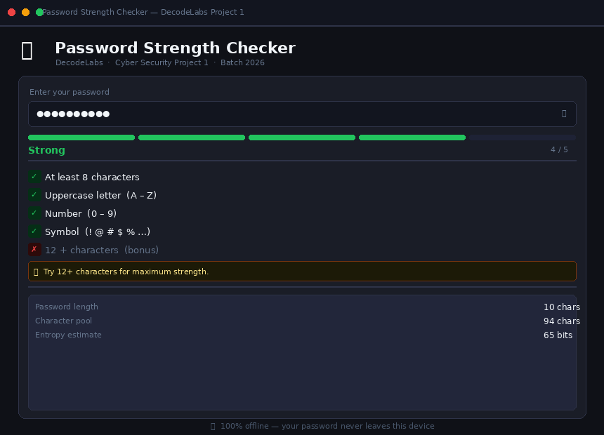
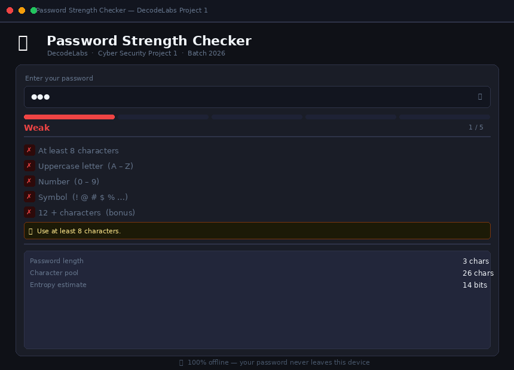
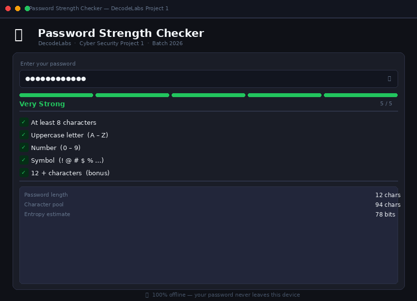

<div align="center">


<br/><br/>

# 🔐 Password Strength Checker

**A defensive cybersecurity tool that evaluates password strength in real time.**  
Built as Project 1 of the DecodeLabs Industrial Training Kit — Batch 2026.

[🚀 Run It](#-getting-started) · [🧠 How It Works](#-how-it-works) · [🔬 Security Concepts](#-security-concepts-covered) · [📊 Report](#-project-report)

</div>

---

## 📸 Screenshots

<div align="center">

| 🟢 Strong Password | 🔴 Weak Password | 🏆 Very Strong |
|---|---|---|
|  |  |  |

</div>

---

## ✨ Features

| Feature | Description |
|---|---|
| 🎨 **Dark UI** | Sleek dark-themed GUI built entirely in Python (tkinter) |
| ⚡ **Real-time analysis** | Strength updates instantly as you type — no button needed |
| 📊 **5-bar strength meter** | Color-coded: Red → Yellow → Green |
| ✅ **Live check rows** | Individual pass/fail for each security rule |
| 🚨 **Breach detection** | Flags passwords from known data leak lists |
| 💡 **Smart tips** | One actionable hint at a time, not a wall of errors |
| 🔬 **Entropy calculator** | Shows bits of entropy + character pool size |
| 👁️ **Toggle visibility** | Show/hide your password with the eye button |
| 🛡️ **100% offline** | Zero network calls — your password never leaves your device |

---

## 🚀 Getting Started

### Requirements
- Python 3.6 or higher
- **No pip installs needed** — `tkinter` ships with Python on Windows, macOS, and Linux

### Run

```bash
python3 password_checker_gui.py
```

That's it. One file, one command.

---

## 🧠 How It Works

### Scoring System (0 – 5 points)

```
✅  Length ≥ 8 characters     →  +1 pt   (gate check — instant fail if missing)
✅  Length ≥ 12 characters    →  +1 pt   (bonus for higher entropy)
✅  Uppercase letter [A-Z]    →  +1 pt
✅  Digit [0-9]               →  +1 pt
✅  Symbol [!@#$%^&*...]      →  +1 pt
```

| Score | Rating | Bar Color |
|---|---|---|
| 0 – 2 | 🔴 Weak | Red |
| 3 | 🟡 Medium | Yellow |
| 4 | 🟢 Strong | Green |
| 5 | 💚 Very Strong | Bright Green |

> ⚠️ **Leaked passwords** are hard-capped at score 1 regardless of complexity.

### Entropy Formula

```
entropy (bits) = length × log₂(pool_size)
```

| Character set used | Pool contribution |
|---|---|
| Lowercase (a–z) | +26 |
| Uppercase (A–Z) | +26 |
| Digits (0–9) | +10 |
| Symbols (!@#...) | +32 |

**Example:** `Hello@123!` → pool = 94, length = 10 → **65 bits of entropy**

---

## 🔬 Security Concepts Covered

### 1 — Pythonic `any()` vs Verbose Loops
The project uses Python's built-in `any()` with generator expressions — C-optimized and short-circuit evaluated:

```python
# ❌ Amateur approach — verbose and slow
found = False
for i in range(len(password)):
    if password[i].isupper():
        found = True
        break

# ✅ Pythonic approach — used in this project
has_upper = any(char.isupper() for char in password)
```

### 2 — Timing Attack Prevention
Standard `==` comparisons leak info through execution time (attackers measure microsecond differences to guess characters). This project uses `hmac.compare_digest()` for constant-time comparison:

```python
is_leaked = any(
    hmac.compare_digest(password.lower(), leaked)
    for leaked in LEAKED_PASSWORDS
)
```

### 3 — The Gatekeeper Rule
> *"You cannot hash what is weak. Filter entropy before Argon2id."*

Validation must happen **before** encryption. A weak password hashed with bcrypt is still weak — the entropy of the input determines the security of the output.

### 4 — The Volatile Memory Trap
Python strings are immutable — they linger in heap memory until garbage collection. In production systems, `bytearray` is used for sensitive data so it can be zeroed out immediately after use.

---

## 📁 Project Structure

```
password-strength-checker/
│
├── password_checker_gui.py    ← Main GUI app (run this)
├── password_checker.py        ← CLI version (terminal only)│
├── preview_strong.png         ← Screenshot — strong password
├── preview_weak.png           ← Screenshot — weak password  
├── preview_very_strong.png    ← Screenshot — very strong password
│
└── README.md
```

---

## 🧪 Test Cases

| Input | Score | Result | Status |
|---|---|---|---|
| `abc` | 0/5 | Weak | ✅ Pass |
| `password` | 0/5 | Leaked — critical | ✅ Pass |
| `hello123` | 2/5 | Weak | ✅ Pass |
| `Hello123` | 3/5 | Medium | ✅ Pass |
| `Hello@123` | 4/5 | Strong | ✅ Pass |
| `Tr0ub4dor&3!` | 5/5 | Very Strong | ✅ Pass |

---

## 📊 Project Report

A full project report covering problem statement, security policy, implementation details, entropy analysis, test cases, and key learnings is included as:

```
Project 1 Report.pdf
```

---

## 🛡️ Part of the DecodeLabs Security Track

```
Project 1  →  Password Strength Checker     ← You are here
Project 2  →  Hashing & Encryption          ← Coming next
Project 3  →  ...
```

---

## 📄 License

Built for educational purposes as part of the **DecodeLabs Industrial Training Program — Batch 2026**.

---

<div align="center">
  <sub>Made with 🔐 by abdulrauf-8 · DecodeLabs Batch 2026</sub>
</div>
